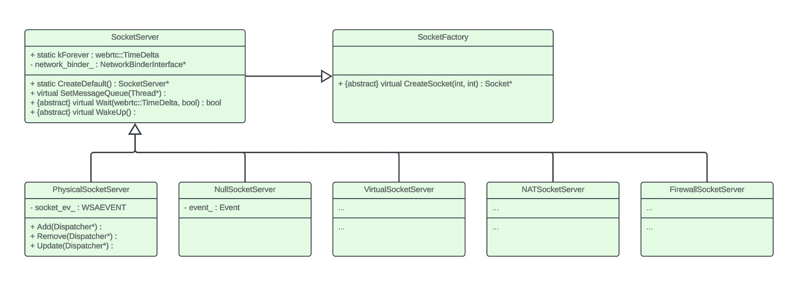

# Event-driven Programming #

**Event-driven programming** is a paradigm where the flow of a program is determined by external events, triggering specific actions or responses within the program.


## Relevant functions in Winsock API ##

For Windows network programming, we commonly use the Winsock API to enable event-driven socket programming. This API allows applications to monitor sockets for specific events such as incoming data or connection requests by creating event objects, thus facilitating efficient event handling.

1. Create a new event object.
    ```c++
    WSAEVENT WSAAPI WSACreateEvent();
    ```

2. Specify an event object to be associated with the specified set of FD_XXX network events.

    ```c++
    int WSAAPI WSAEventSelect(
    [in] SOCKET   s,
    [in] WSAEVENT hEventObject,
    [in] long     lNetworkEvents
    );
    ```

3. Wait until one (or all) of the specified event objects is in the signaled state, or the time-out interval expires.

    ```c++
    DWORD WSAAPI WSAWaitForMultipleEvents(
    [in] DWORD          cEvents,
    [in] const WSAEVENT *lphEvents,
    [in] BOOL           fWaitAll,
    [in] DWORD          dwTimeout,
    [in] BOOL           fAlertable
    );
    ```

4. Discover occurrences of network events for the indicated socket, clear internal network event records, and reset event objects.
    ```c++
    int WSAAPI WSAEnumNetworkEvents(
    [in]  SOCKET             s,
    [in]  WSAEVENT           hEventObject,
    [out] LPWSANETWORKEVENTS lpNetworkEvents
    );
    ```

5. Reset the state of the specified event object to nonsignaled.
    ```c++
    BOOL WSAAPI WSAResetEvent(
    [in] WSAEVENT hEvent
    );
    ```


## Relevant functions in Windows API ##

In Windows programming, particularly for graphical user interface (GUI) applications, we often utilize the Windows API to implement event-driven programming. 

This API enables applications to respond dynamically to user actions and system events by registering event handlers for various types of messages and notifications. By creating event-driven structures and associating them with user interface elements, developers can build responsive and interactive applications that efficiently handle user input and system events

1. Create or open a named or unnamed event object.

    ```c++
    HANDLE CreateEvent(
    [in, optional] LPSECURITY_ATTRIBUTES lpEventAttributes,
    [in]           BOOL                  bManualReset,
    [in]           BOOL                  bInitialState,
    [in, optional] LPCSTR                lpName
    );
    ```

2. Wait until the specified object is in the signaled state or the time-out interval elapses.

    ```c++
    DWORD WaitForSingleObject(
    [in] HANDLE hHandle,
    [in] DWORD  dwMilliseconds
    );
    ```

3. Set the specified event object to the signaled state.

    ```c++
    BOOL SetEvent(
    [in] HANDLE hEvent
    );
    ```

4. Set the specified event object to the nonsignaled state.
    ```c++
    BOOL ResetEvent(
    [in] HANDLE hEvent
    );
    ```

## Usage in SocketServer object ##

In WebRTC, ```rtc::SocketServer``` is an abstract class that inherits from ```rtc::SocketFactory```. It provides the capability to manage socket-based communication and includes methods for waiting for and handling socket events asynchronously.



```rtc::PhysicalSocketServer``` is one of the concrete implementation of ```rtc::SocketServer```. Its primary function is to manage the actual sockets provided by the underlying operating system, enabling seamless interaction between WebRTC components and the network infrastructure.

An example in ```PhysicalSocketServer``` which uses the Winsock API to implement event-driven programming
```c++
// rtc_base/physical_socket_server.cc

PhysicalSocketServer::PhysicalSocketServer()
    : socket_ev_(WSACreateEvent()),
    fWait_(false) {
    // ...
}

bool PhysicalSocketServer::Wait(webrtc::TimeDelta max_wait_duration, bool process_io) {
    // ...
    for (uint64_t key : current_dispatcher_keys_) {
        if (!dispatcher_by_key_.count(key)) {
            continue;
        }
        Dispatcher* disp = dispatcher_by_key_.at(key);
        if (!disp)
            continue;
        if (!process_io && (disp != signal_wakeup_))
            continue;
        SOCKET s = disp->GetSocket();
        if (disp->CheckSignalClose()) {
            // We just signalled close, don't poll this socket.
        } else if (s != INVALID_SOCKET) {
            WSAEventSelect(s, events[0], FlagsToEvents(disp->GetRequestedEvents()));
        } else {
            events.push_back(disp->GetWSAEvent());
            event_owners.push_back(key);
        }
    }
    // ...
    // Wait for one of the events to signal
    DWORD dw = WSAWaitForMultipleEvents(static_cast<DWORD>(events.size()), &events[0],
                                        false, static_cast<DWORD>(cmsNext), false);
    // ...                                    
}
```

