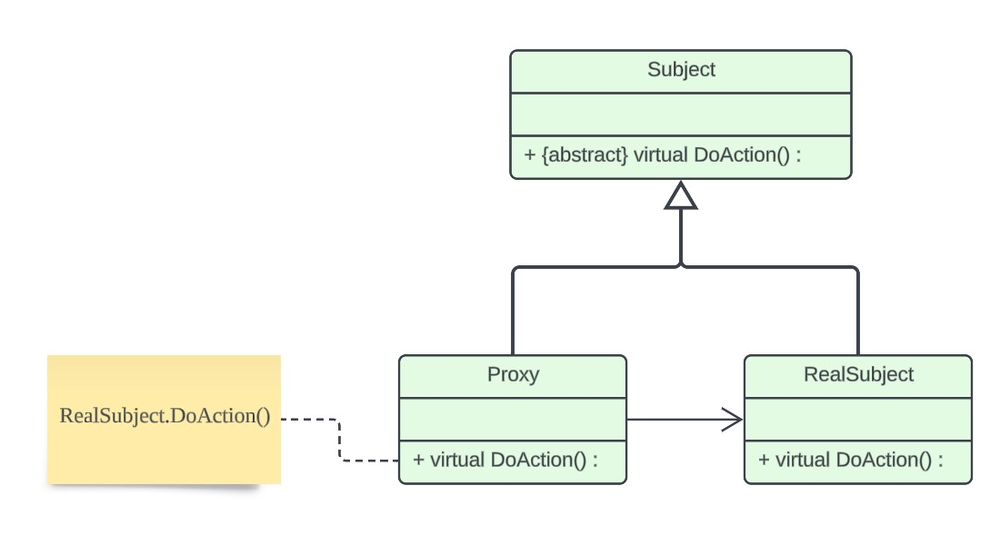
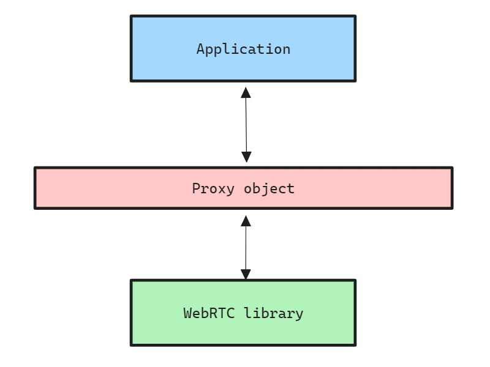

# Proxy Pattern #

The Proxy design pattern is a structural design pattern from the "Gang of Four" (GoF) that provides a surrogate or placeholder for another object to control access to it. The pattern involves the following components:

+ **Subject**: Defines a common interface for **RealSubject** and **Proxy**.
+ **RealSubject**: The actual object that the proxy represents.
+ **Proxy**: Controls access to the **RealSubject**, implements the same interface, and may add functionality like lazy initialization, logging, or access control.



## Proxy in WebRTC ##

WebRTC uses the proxy model to make sure its features work safely, hide complex details, and allow for easy improvements. It's like having a helpful assistant (the proxy) who handles all the tricky stuff behind the scenes, making it simpler for you to use WebRTC's features without worrying about the technicalities.

Example usage:

```c++
// pc/proxy.h

// Subject - XXXInterface
class TestInterface : public rtc::RefCountInterface {
public:
  std::string FooA() = 0;
  std::string FooB(bool arg1) const = 0;
  std::string FooC(bool arg1) = 0;
};

// RealSubject - XXX
class Test : public TestInterface {
  // ... implementation of the interface.
};

// Proxy - XXXProxy (XXXProxyWithInternal)
BEGIN_PROXY_MAP(Test)
  PROXY_PRIMARY_THREAD_DESTRUCTOR()
  PROXY_METHOD0(std::string, FooA)
  PROXY_CONSTMETHOD1(std::string, FooB, arg1)
  PROXY_SECONDARY_METHOD1(std::string, FooC, arg1)
END_PROXY_MAP()
```
With this, an application can use Proxy object to safely invoke WebRTC core functions.

