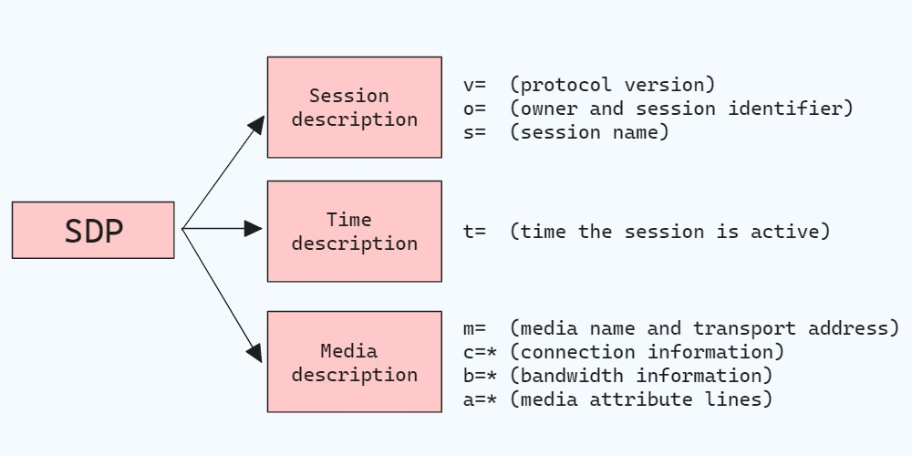
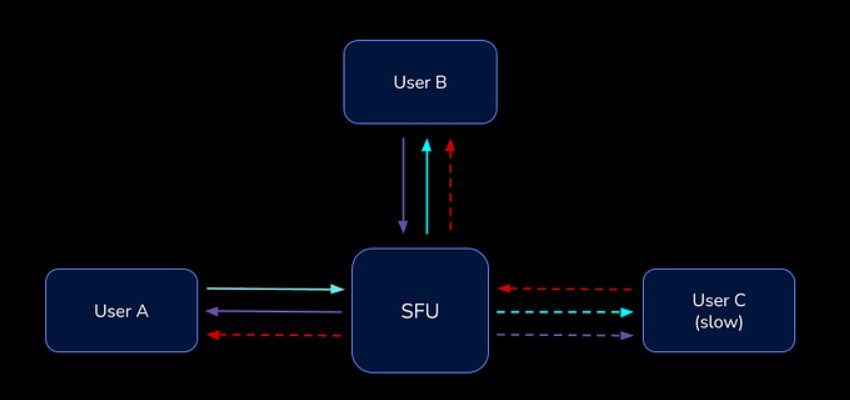
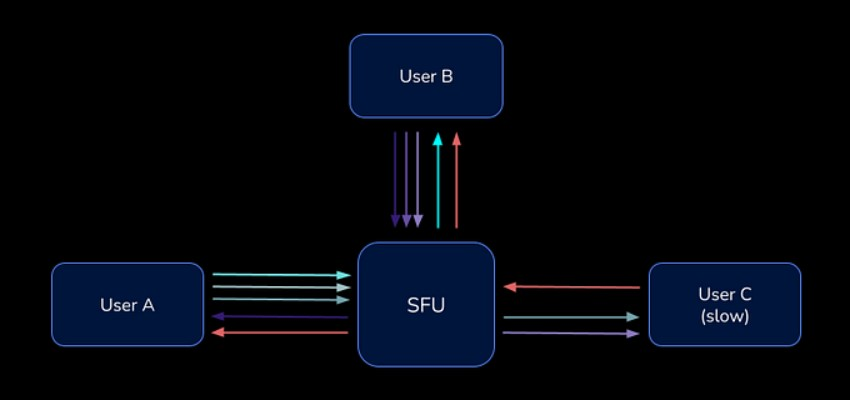
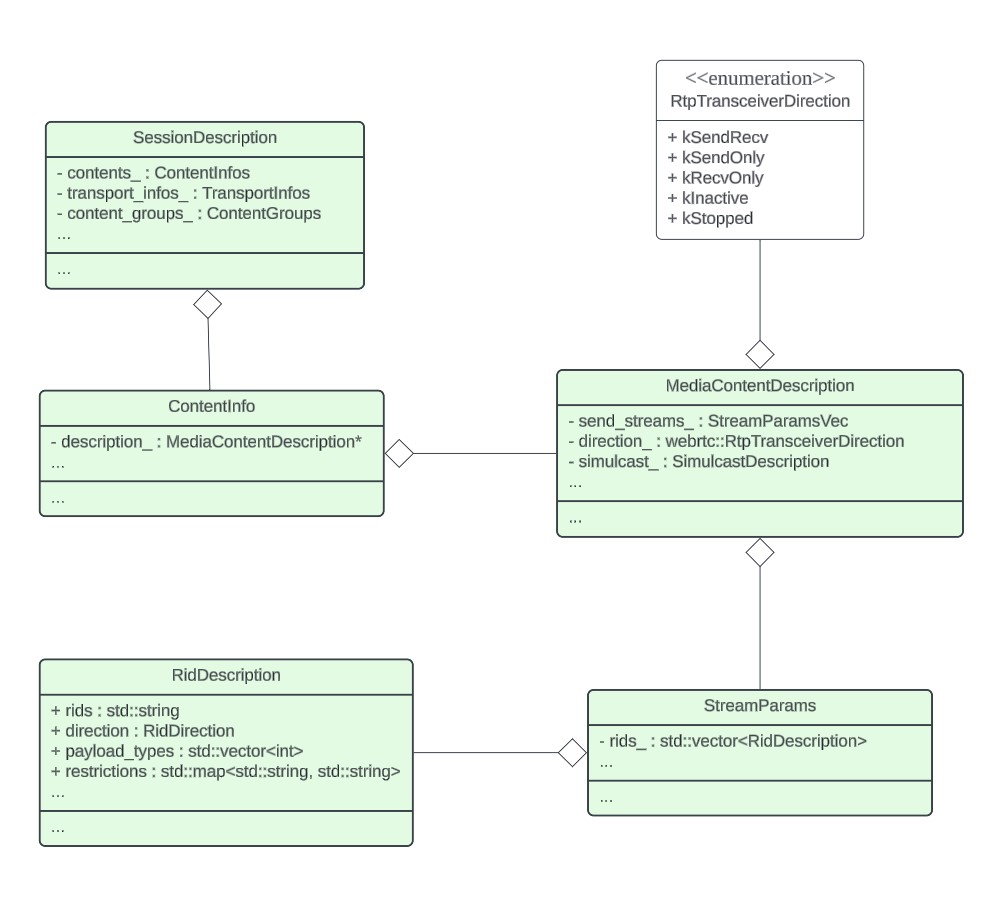

# SDP #

**Session Description Protocol (SDP)** is a format for describing the multimedia content of the communication sessions such as streaming video, audio, or data between peers. It is used for negotiating the parameters of the communication session.

An SDP message consists of a number of lines of text of the form ```<type>=<value>```, which can be categorized into 3 sections:
+ **Session description**: session-level information.
+ **Time description**: session timing information.
+ **Media description**: describes the media streams in the session, such as audio, video, or text.



> Details in https://www.ietf.org/rfc/rfc2327.txt

## Simulcast ##
Simulcast is a feature in WebRTC that enables a single video source, such as a camera, to be encoded into multiple streams with varying resolutions and/or bitrates. These streams are sent simultaneously over the network to accommodate different network conditions and client capabilities.

Previously, users with limited bandwidth or processing power often struggled to receive good-quality media, which could degrade their overall experience. 



<br>

Simulcast addresses this issue by allowing a WebRTC client to encode the same video source into multiple streams at different qualities. This means that a "slow" user, facing bandwidth constraints or device limitations, can select a stream with a lower resolution or bitrate that matches their current network conditions. This adaptive streaming approach helps ensure smoother playback and improved user experience. 



## Plan B and Unified Plan ##

In **Plan B**, one "m=" section of SDP is typically used for each media type (e.g., one for video and one for audio). Each "m=" section can contain multiple "a=ssrc" lines for different SSRC identifiers within the same section.

```sdp
m=audio 49170 RTP/AVP 101
a=ssrc:1 msid:left-mic
a=ssrc:2 msid:center-mic
a=ssrc:3 msid:right-mic
```

**Unified Plan**, on the other hand, assigns each individual media track to its own distinct "m=" section in SDP. This approach provides a more granular representation of media tracks, especially useful in scenarios with multiple streams or layered encodings.

```sdp
a=group:BUNDLE m1 m2 m3
...
m=audio 56600 RTP/SAVPF 0 109
a=msid:left-mic
a=mid:m1
...
m=video 56601 RTP/SAVPF 99 120
a=msid:center-mic
a=mid:m2
...
m=video 56602 RTP/SAVPF 99 120
a=msid:right-mic
a=mid:m3
```


# SDP in WebRTC #



### SessionDescription ###
It manages the description of multimedia sessions, handling media content, transport details, and other session attributes. It provides methods for accessing, modifying, and interpreting SDP information necessary for establishing and maintaining WebRTC communications. 

```c++
// pc/session_description.h

typedef std::vector<ContentInfo> ContentInfos;
typedef std::vector<ContentGroup> ContentGroups;

class SessionDescription {
    ...
private:
    ...
    ContentInfos contents_;
    TransportInfos transport_infos_;
    ContentGroups content_groups_;
}
```

### ContentInfo ###
It represents a session description section. Most information about the section is stored in the description.

```c++
// pc/session_description.h

class ContentInfo {
    ...
private:
    ...
    std::unique_ptr<MediaContentDescription> description_;
}
```

### MediaContentDescription ###

It describes a session description media section. There are subclasses for each media type (audio, video and data) that will have additional information.

```c++
// pc/session_description.h

class MediaContentDescription {
    ...
private:
    ...
    // a=rtcp-mux
    bool rtcp_mux_ = false;
    // a=rtcp-rsize
    bool rtcp_reduced_size_ = false;
    StreamParamsVec send_streams_;
    // a=sendrecv
    webrtc::RtpTransceiverDirection direction_ = webrtc::RtpTransceiverDirection::kSendRecv;
    SimulcastDescription simulcast_;
}
```

### StreamParams ###

it represents a sender/track in a SessionDescription.
+ In **Plan B** (obsolete), it means multiple StreamParams can exist within one MediaContentDescription
+ In **Unified Plan**, it means there is one StreamParams per MediaContentDescription.

```c++
// media/base/stream_params.h

struct StreamParams {
    ...
    // A unique identifier of the StreamParams object. When the SDP is created,
    // this comes from the track ID of the sender that the StreamParams object
    // is associated with.
    std::string id;
    // There may be no SSRCs stored in unsignaled case when stream_ids are
    // signaled with a=msid lines.
    std::vector<uint32_t> ssrcs;         // All SSRCs for this source
    std::vector<SsrcGroup> ssrc_groups;  // e.g. FID, FEC, SIM
    std::string cname;                   // RTCP CNAME  
    // The stream IDs of the sender that the StreamParams object is associated
    // with. In Plan B this should always be size of 1, while in Unified Plan this
    // could be none or multiple stream IDs.
    std::vector<std::string> stream_ids_;
    std::vector<RidDescription> rids_;
}

typedef std::vector<StreamParams> StreamParamsVec;
```