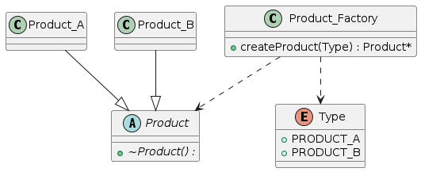
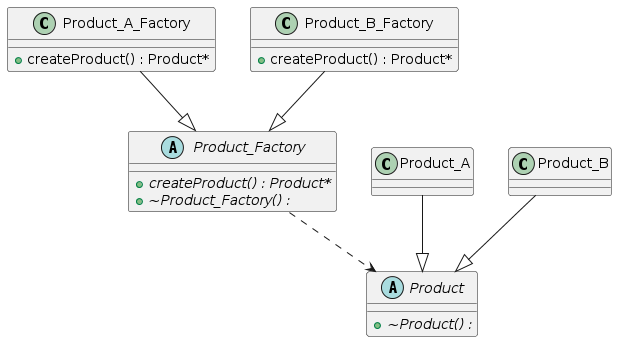
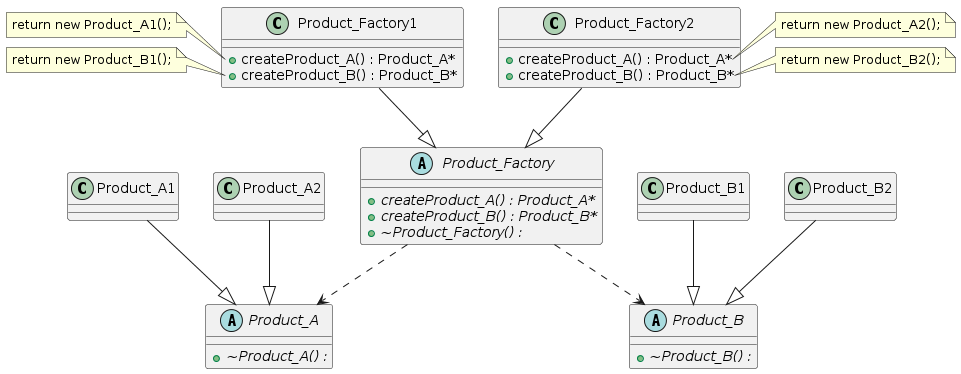

# Factory Pattern #

Factory Method is a creational design pattern that provides an interface for creating objects in a superclass, but allows subclasses to alter the type of objects that will be created.

## Simple Factory Pattern ##

It provides a single factory class to create objects based on input parameters or conditions, which typically doesn't fully adhere to the **Open-Closed Principle (OCP)** because adding new products often requires modifying the factory class itself.




## Factory Method Pattern ##

It defines an abstract factory interface for creating objects, where each specific factory class decides which concrete product to instantiate. This pattern allows adding new products by introducing new concrete product classes and corresponding factory classes, without modifying existing code that uses the abstract factory interface.



## Abstract Factory Pattern ##

It provides an interface for creating families of related or dependent objects without specifying their concrete classes. This pattern ensures compatibility within families of products, allowing the system to work with multiple families of products interchangeably.




# Examples in WebRTC#

In WebRTC, the Factory Pattern is widely used to create and manage instances of various components such as peer connections, media streams, and data channels.


## Factory Method Pattern ##

**Helper object** - a tool class used for factory function
```c++
// api/audio_codecs/audio_encoder_factory_template.h
// Base case: 0 template parameters.
template <>
struct Helper<> {
    static void AppendSupportedEncoders(std::vector<AudioCodecSpec>* specs) {}
    static absl::optional<AudioCodecInfo> QueryAudioEncoder(const SdpAudioFormat& format) {
        return absl::nullopt;
    }

    static std::unique_ptr<AudioEncoder> MakeAudioEncoder(int payload_type, const SdpAudioFormat& format, absl::optional<AudioCodecPairId> codec_pair_id, const FieldTrialsView* field_trials) {
        return nullptr;
    }
};

// Inductive case: Called with n + 1 template parameters; calls subroutines
// with n template parameters.
template <typename T, typename... Ts>
struct Helper<T, Ts...> {
    static void AppendSupportedEncoders(std::vector<AudioCodecSpec>* specs) {
        T::AppendSupportedEncoders(specs);
        Helper<Ts...>::AppendSupportedEncoders(specs);
    }
    static absl::optional<AudioCodecInfo> QueryAudioEncoder(const SdpAudioFormat& format) {
        auto opt_config = T::SdpToConfig(format);
        static_assert(std::is_same<decltype(opt_config), absl::optional<typename T::Config>>::value, "T::SdpToConfig() must return a value of type" "absl::optional<T::Config>");
        return opt_config ? absl::optional<AudioCodecInfo>(T::QueryAudioEncoder(*opt_config)) : Helper<Ts...>::QueryAudioEncoder(format);
    }
    static std::unique_ptr<AudioEncoder> MakeAudioEncoder(
        int payload_type,
        const SdpAudioFormat& format,
        absl::optional<AudioCodecPairId> codec_pair_id,
        const FieldTrialsView* field_trials) {
        auto opt_config = T::SdpToConfig(format);
        if (opt_config) {
            return T::MakeAudioEncoder(*opt_config, payload_type, codec_pair_id);
        } else {
            return Helper<Ts...>::MakeAudioEncoder(payload_type, format,
                                             codec_pair_id, field_trials);
        }
    }
};
```

**Audio Encoder Factory**

```c++
// api/audio_codecs/audio_encoder_factory_template.h
template <typename... Ts>
class AudioEncoderFactoryT : public AudioEncoderFactory {
public:
    explicit AudioEncoderFactoryT(const FieldTrialsView* field_trials) {
        field_trials_ = field_trials;
    }
    std::vector<AudioCodecSpec> GetSupportedEncoders() override {
        std::vector<AudioCodecSpec> specs;
        Helper<Ts...>::AppendSupportedEncoders(&specs);
        return specs;
    }

    absl::optional<AudioCodecInfo> QueryAudioEncoder(
        const SdpAudioFormat& format) override {
        return Helper<Ts...>::QueryAudioEncoder(format);
    }

    std::unique_ptr<AudioEncoder> MakeAudioEncoder(
        int payload_type,
        const SdpAudioFormat& format,
        absl::optional<AudioCodecPairId> codec_pair_id) override {
            return Helper<Ts...>::MakeAudioEncoder(payload_type, format, codec_pair_id, field_trials_);
        }

    const FieldTrialsView* field_trials_;
};

template <typename... Ts>
rtc::scoped_refptr<AudioEncoderFactory> CreateAudioEncoderFactory(const FieldTrialsView* field_trials = nullptr) {
    static_assert(sizeof...(Ts) >= 1, "Caller must give at least one template parameter");
    return rtc::make_ref_counted<audio_encoder_factory_template_impl:: <Ts...>>(field_trials);
}
```


## Abstract Factory Pattern ##

In WebRTC, peer-to-peer communication starts once `PeerConnection`  created.

```c++
// api/create_peerconnection_factory.h
RTC_EXPORT rtc::scoped_refptr<PeerConnectionFactoryInterface>
CreatePeerConnectionFactory(
    rtc::Thread* network_thread,
    rtc::Thread* worker_thread,
    rtc::Thread* signaling_thread,
    rtc::scoped_refptr<AudioDeviceModule> default_adm,
    rtc::scoped_refptr<AudioEncoderFactory> audio_encoder_factory,
    rtc::scoped_refptr<AudioDecoderFactory> audio_decoder_factory,
    std::unique_ptr<VideoEncoderFactory> video_encoder_factory,
    std::unique_ptr<VideoDecoderFactory> video_decoder_factory,
    rtc::scoped_refptr<AudioMixer> audio_mixer,
    rtc::scoped_refptr<AudioProcessing> audio_processing,
    std::unique_ptr<AudioFrameProcessor> audio_frame_processor = nullptr,
    std::unique_ptr<FieldTrialsView> field_trials = nullptr);

// pc/peer_connection_factory.h
class PeerConnectionFactory : public PeerConnectionFactoryInterface {}

// pc/peer_connection.h
class PeerConnection : public PeerConnectionInternal,
                       public JsepTransportController::Observer {}   

// pc/peer_connection_internal.h
class PeerConnectionInternal : public PeerConnectionInterface,
                               public PeerConnectionSdpMethods {}
                            
```

In Example program "peerconnection client", `peer_connection_factory_` is the factory object ,which used to create `PeerConnection` object `peer_connection_`.

```c++
// examples/peerconnection/client/conductor.cc
bool Conductor::InitializePeerConnection() {
    // ...
    peer_connection_factory_ = webrtc::CreatePeerConnectionFactory(
        nullptr /* network_thread */, nullptr /* worker_thread */,
        signaling_thread_.get(), nullptr /* default_adm */,
        webrtc::CreateBuiltinAudioEncoderFactory(),
        webrtc::CreateBuiltinAudioDecoderFactory(),
        std::make_unique<webrtc::VideoEncoderFactoryTemplate<
            webrtc::LibvpxVp8EncoderTemplateAdapter,
            webrtc::LibvpxVp9EncoderTemplateAdapter,
            webrtc::OpenH264EncoderTemplateAdapter,
            webrtc::LibaomAv1EncoderTemplateAdapter>>(),
        std::make_unique<webrtc::VideoDecoderFactoryTemplate<
            webrtc::LibvpxVp8DecoderTemplateAdapter,
            webrtc::LibvpxVp9DecoderTemplateAdapter,
            webrtc::OpenH264DecoderTemplateAdapter,
            webrtc::Dav1dDecoderTemplateAdapter>>(),
            nullptr /* audio_mixer */, nullptr /* audio_processing */);
    // ...
}

bool Conductor::CreatePeerConnection() {
    // ...
    auto error_or_peer_connection = peer_connection_factory_->CreatePeerConnectionOrError(config, std::move(pc_dependencies));
    if (error_or_peer_connection.ok()) {
        peer_connection_ = std::move(error_or_peer_connection.value());
    }
    // ...
}
```


