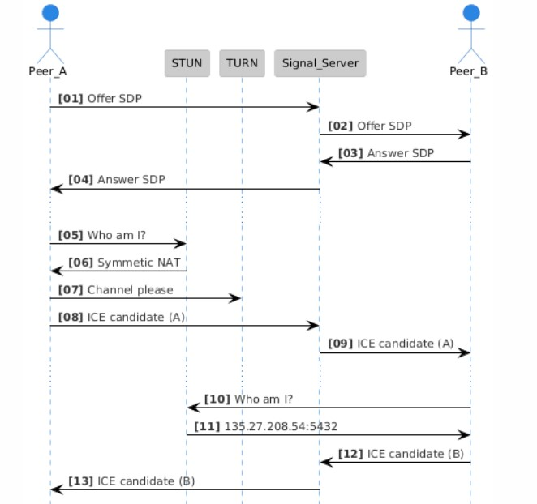
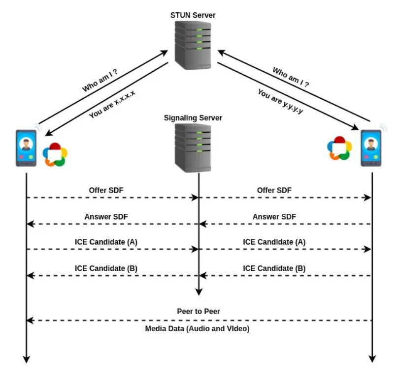
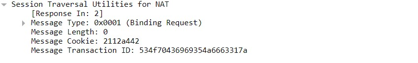
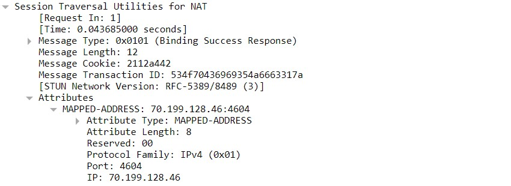
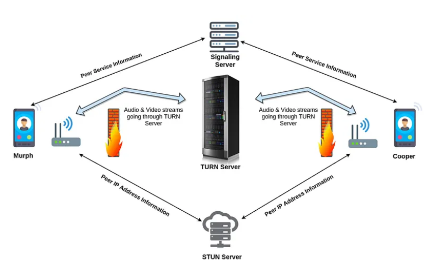
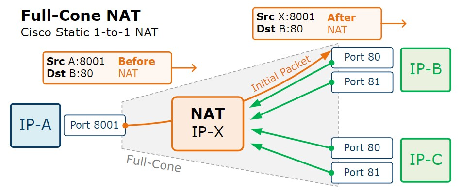
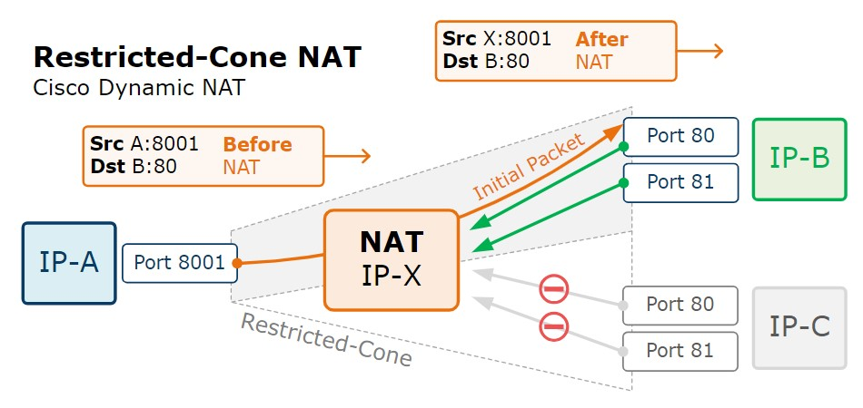
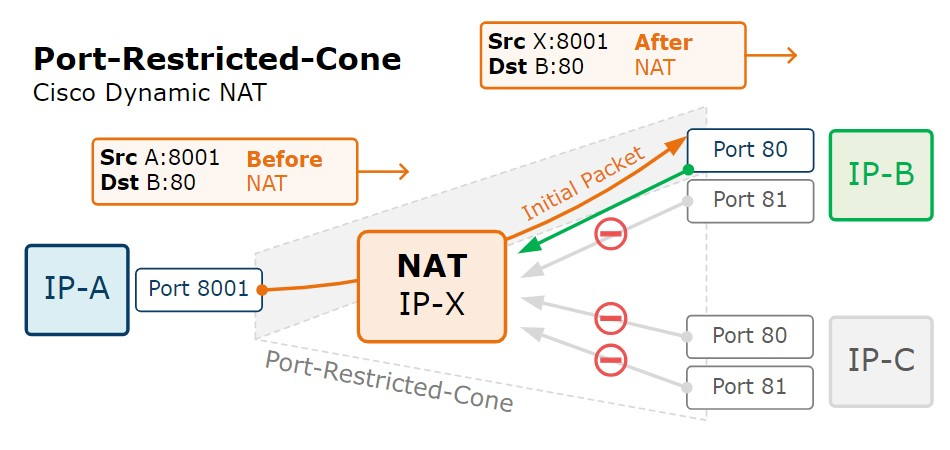
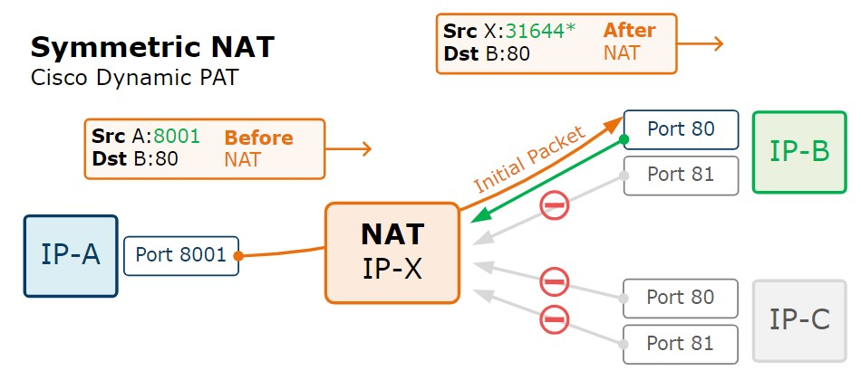

# ICE #

**Interactive Connectivity Establishment (ICE)** is a protocol essential for real-time communication over the Internet, particularly in applications such as VoIP, peer-to-peer communications, video conferencing, and instant messaging. Its primary function is to enable direct communication between two devices or endpoints despite challenges posed by NATs, firewalls, and specific network policies.

ICE achieves this by systematically identifying and establishing potential communication paths, referred to as **candidates**, between the communicating peers. It leverages protocols like **STUN** and **TURN** to facilitate successful media traversal across different IP networks and network configurations.


An example of ICE candidate (`a=candidate`) in SDP, which defined in [RFC 5245](https://datatracker.ietf.org/doc/html/rfc5245#page-73).

```
v=0
o=jdoe 2890844526 2890842807 IN IP4 10.0.1.1
s=
c=IN IP4 192.0.2.3
t=0 0
a=ice-pwd:asd88fgpdd777uzjYhagZg
a=ice-ufrag:8hhY
m=audio 45664 RTP/AVP 0
b=RS:0
b=RR:0
a=rtpmap:0 PCMU/8000
a=candidate:1 1 UDP 2130706431 10.0.1.1 8998 typ host
a=candidate:2 1 UDP 1694498815 192.0.2.3 45664 typ srflx raddr 10.0.1.1 rport 8998
```
## Message exchange



<br>
<br>

# Session Traversal Utilities for NAT (STUN) #

STUN complements ICE through NATs using UDP protocol. It helps applications identify the presence and types of NATs and firewalls in the network. Any device can use STUN to find out its allocated IP address and port from a NAT.
In a typical scenario, a STUN client sends messages to a STUN server to obtain public IP and port information, which the server then retrieves. Clients can use this information for peer-to-peer communication over the Internet.



## STUN Message Structure ##

All STUN messages MUST start with a 20-byte header followed by zero or more Attributes. Each attribute is TLV (Type-Length-Value) encoded.

```
 0                   1                   2                   3
 0 1 2 3 4 5 6 7 8 9 0 1 2 3 4 5 6 7 8 9 0 1 2 3 4 5 6 7 8 9 0 1
+-+-+-+-+-+-+-+-+-+-+-+-+-+-+-+-+-+-+-+-+-+-+-+-+-+-+-+-+-+-+-+-+
|0 0|     STUN Message Type     |         Message Length        |
+-+-+-+-+-+-+-+-+-+-+-+-+-+-+-+-+-+-+-+-+-+-+-+-+-+-+-+-+-+-+-+-+
|                         Magic Cookie                          |
+-+-+-+-+-+-+-+-+-+-+-+-+-+-+-+-+-+-+-+-+-+-+-+-+-+-+-+-+-+-+-+-+
|                                                               |
|                     Transaction ID (96 bits)                  |
|                                                               |
+-+-+-+-+-+-+-+-+-+-+-+-+-+-+-+-+-+-+-+-+-+-+-+-+-+-+-+-+-+-+-+-+
```

## Example ##

**STUN request**



**STUN response** 




## Traversal Using Relays around NAT (TURN) ##

**TURN (Traversal Using Relays around NAT)** is a protocol that helps WebRTC applications navigate through **network address translators (NAT)** or firewalls. It allows clients to exchange data through an intermediary server called a **TURN Server**. TURN is an extension of STUN.

Here's how it works: A TURN client first contacts the TURN server to get an allocated IP address and port. After successful allocation, the client uses this information to communicate with peers. TURN packets carry the destination address of the peer, convert them into UDP protocol packets, and send them to the peer.
TURN is particularly helpful for Web, Mobile, and IoT clients on networks with symmetric NAT devices. However, it comes with a higher cost due to server utilization and substantial bandwidth usage, especially with numerous client connections.



<br>
<br>

# Network Address Translation (NAT) #

**Network Address Translation (NAT)** is a method used in computer networks to modify network address information in the IP header of packets while they are in transit across a traffic routing device. The primary use of NAT is to limit the number of public IP addresses needed by an organization or to hide the internal IP addresses from the external network for security purposes.

[RFC 3489](https://datatracker.ietf.org/doc/html/rfc3489#page-5) classified 4 NAT implementations:

## Full Cone ##

A **full cone NAT** maps all requests from the same internal IP address and port to the same external IP address and port. Any external host can send a packet to the internal host by sending it to the mapped external address.



## Restricted Cone ##

A **restricted cone NAT** also maps all requests from the same internal IP address and port to the same external IP address and port. However, an external host can only send a packet to the internal host if the internal host had previously sent a packet to the external host's IP address.



## Port Restricted Cone ##

A **port restricted cone NAT** is similar to a restricted cone NAT but includes port numbers in the restriction. An external host can send a packet to the internal host only if the internal host had previously sent a packet to the external host's IP address and port.



## Symmetric ##

A **symmetric NAT** maps requests from the same internal IP address and port to different external IP addresses and ports based on the destination IP address and port. Only the external host that receives a packet can send a UDP packet back to the internal host.



## NAT traversal between peers in STUN/TURN ##

<table style="width: 100%; border: 1px solid black; border-collapse: collapse;">
  <thead>
    <tr style="background-color: #f2f2f2; color: black;">
      <th style="border: 1px solid black; padding: 8px; width: 20%">NAT Type</th>
      <th style="border: 1px solid black; padding: 8px; width: 20%;">Full Cone</th>
      <th style="border: 1px solid black; padding: 8px; width: 20%;">Restricted Cone</th>
      <th style="border: 1px solid black; padding: 8px; width: 20%;">Port Restricted Cone</th>
      <th style="border: 1px solid black; padding: 8px; width: 20%;">Symmetric</th>
    </tr>
  </thead>
  <tbody>
    <tr style="background-color: #e6f7ff; color: black;">
      <th style="border: 1px solid black; padding: 8px;">Full Cone</th>
      <td style="border: 1px solid black; padding: 8px;">STUN</td>
      <td style="border: 1px solid black; padding: 8px;">STUN</td>
      <td style="border: 1px solid black; padding: 8px;">STUN</td>
      <td style="border: 1px solid black; padding: 8px;">STUN</td>
    </tr>
    <tr style="background-color: #ffffff; color: black;">
      <th style="border: 1px solid black; padding: 8px;">Restricted Cone</th>
      <td style="border: 1px solid black; padding: 8px;">STUN</td>
      <td style="border: 1px solid black; padding: 8px;">STUN</td>
      <td style="border: 1px solid black; padding: 8px;">STUN</td>
      <td style="border: 1px solid black; padding: 8px;">STUN</td>
    </tr>
    <tr style="background-color: #e6f7ff; color: black;">
      <th style="border: 1px solid black; padding: 8px;">Port Restricted Cone</th>
      <td style="border: 1px solid black; padding: 8px;">STUN</td>
      <td style="border: 1px solid black; padding: 8px;">STUN</td>
      <td style="border: 1px solid black; padding: 8px;">STUN</td>
      <td style="border: 1px solid black; padding: 8px; font-weight: bold; color: red;">TURN</td>
    </tr>
    <tr style="background-color: #ffffff; color: black;">
      <th style="border: 1px solid black; padding: 8px;">Symmetric</th>
      <td style="border: 1px solid black; padding: 8px;">STUN</td>
      <td style="border: 1px solid black; padding: 8px;">STUN</td>
      <td style="border: 1px solid black; padding: 8px; font-weight: bold; color: red;">TURN</td>
      <td style="border: 1px solid black; padding: 8px; font-weight: bold; color: red;">TURN</td>
    </tr>
  </tbody>
</table>

<br>


