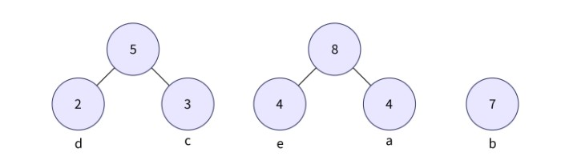

# Lossy Audio Compression #

Lossy audio compression typically achieves far greater compression than lossless compression, by discarding less-critical data based on **psychoacoustic optimizations**.

Psychoacoustic optimization is a technique used in audio processing and compression. It takes advantage of the human auditory system's characteristics and limitations to minimize the perceived loss of audio quality while reducing file size.
Some common psychoacoustic optimizations:
+ **Frequency Masking**: the presence of a louder sound at a particular frequency makes it difficult or impossible to hear a quieter sound at nearby frequencies.

+ **Temporal Masking**: a loud sound makes it difficult to hear a quieter sound that occurs shortly before or after it in time.

## Entropy coding ##

For further reducing file size after psychoacoustic optimizations and encoding, we usually use **entropy coding** to efficiently reduce the file size while maintaining the perceived audio quality.

Entropy coding takes advantage of the statistical properties of the encoded data to assign shorter codes to more frequently occurring symbols and longer codes to less frequently occurring symbols.

In audio compression, particularly for lossy compression formats like MP3 and AAC, the most commonly used entropy coding method is **Huffman coding**.

Example (https://www.scaler.com/topics/huffman-coding/)

**Step 1**: calculate the frequency of each character in the given string.

**Step 2**: get two minimum frequency nodes, and form a new node which frequency is 5 (2+3).

**Step 3**: repeat step 2.

**Step 4**: repeat step 2.

**Step 5**: repeat step 2.

**Step 6**: assign weight 0 and 1 to left and right edge to each node, or vice versa.

**Step 7**: get the code for each character by traversing the full tree.

## Lossy audio codec ##

List some widely used lossy audio codecs for compressing audio data while maintaining acceptable quality:
+ **MP3 (MPEG-1 Audio Layer III)**: perhaps the most well-known and widely used lossy audio codec.
+ **AAC (Advanced Audio Coding)**: a successor to MP3 and is known for its improved compression efficiency and audio quality. 
+ **Opus**: a versatile lossy audio codec developed by the (IETF) that supports both speech and general audio.
