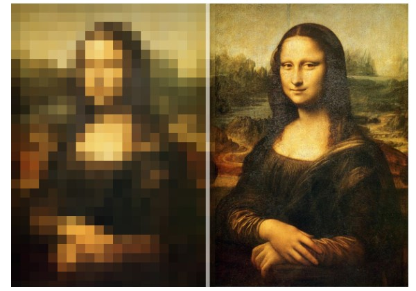
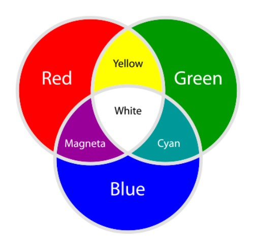
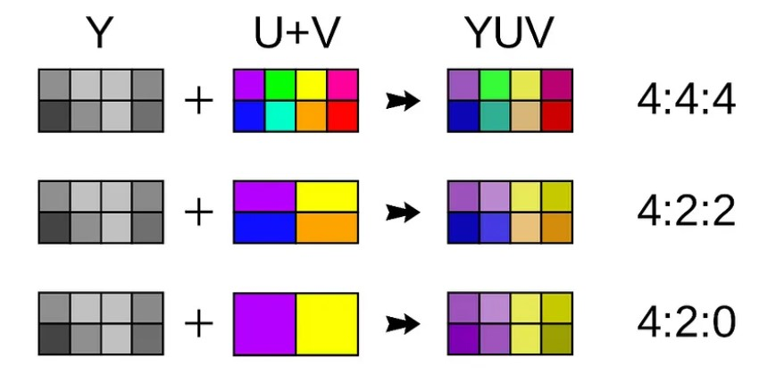

# Basics of Digital Image #

The **digital image** is a visual representation stored in a digital format. It is composed of discrete units called **pixels**, each containing color and brightness information, arranged in a grid pattern. 



The basic attributes of a digital image typically include:
+ **Dimension**:  the size of the image, expressed as the number of pixels in width and height (e.g., 1920x1080).
+ **Color model**: a mathematical representation that defines how colors are represented and manipulated within the image.
+ **File format**: the format in which the image data is stored, such as JPEG, PNG, GIF, BMP, TIFF, etc.

## RGB ##

The RGB color model is one of the most widely used color representation method. As an additive color system, it combines red, green, and blue light to create the colors we see on our TV screens, computer monitors, and smartphones.



The number of bits used to provide R,G,B information (ie the color depth) determines the maximum number of color variations that can be represented by a specific RGB model. Typical values for modern video is 8 bits (one byte) for each R,G,B primary. Typical specific RGB formats for video are RGB32 and RGB24.

### RGB24 ###
RGB24 allocates 8 bits (1 byte) to each of the three primary color channels: red, green, and blue. It is commonly used in applications where color accuracy and compatibility are important but transparency is not required.

```
low memory address    ---->      high memory address
|pixel|pixel|pixel|pixel|pixel|pixel|pixel|pixel|...
|-----|-----|-----|-----|-----|-----|-----|-----|...
|B|G|R|B|G|R|B|G|R|B|G|R|B|G|R|B|G|R|B|G|R|B|G|R|...
```

### RGB32 ###
Similar to RGB24, RGB32 includes an additional 8-bit alpha channel, bringing the total number of bits per pixel to 32.  The alpha channel represents transparency or opacity, allowing for the creation of images with varying levels of transparency.

```
low memory address    ---->      high memory address
| pixel | pixel | pixel | pixel | pixel | pixel |...
|-------|-------|-------|-------|-------|-------|...
|B|G|R|A|B|G|R|A|B|G|R|A|B|G|R|A|B|G|R|A|B|G|R|A|...
```

## YUV ##
The YUV color model consists of one luma (a.k.a. brightness) component, Y, and two chroma components, U and V.

The YUV color model is used in video encoding and transmission because of its compatibility with legacy black-and-white receivers, which can display only the luma (Y) channel of the signal.



### YUV444 ###

In YUV444, each pixel has its own separate Y, U and V channel. 24 bits per pixel.

```
low memory address    ---->      high memory address
|pixel|pixel|pixel|pixel|pixel|pixel|pixel|pixel|...
|-----|-----|-----|-----|-----|-----|-----|-----|...
|Y|U|V|Y|U|V|Y|U|V|Y|U|V|Y|U|V|Y|U|V|Y|U|V|Y|U|V|...

```

### YUV422 ###

In YUV422, the chroma components (U and V) are subsampled horizontally, meaning that each row of pixels shares the same U and V values. 16 bits per pixel.

```
low memory address    ---->      high memory address
|pixel|pixel|pixel|pixel|pixel|pixel|pixel|pixel|...
|-----|-----|-----|-----|-----|-----|-----|-----|...
|Y|U|V|  Y  |Y|U|V|  Y  |Y|U|V|  Y  |Y|U|V|  Y  |...

```

### YUV420 ###

both the chroma components (U and V) are subsampled horizontally and vertically. This means that each 2x2 block of pixels shares the same U and V values. 12 bits per pixel.

```
low memory address    ---->      high memory address
|pixel|pixel|pixel|pixel|pixel|pixel|pixel|pixel|...
|-----|-----|-----|-----|-----|-----|-----|-----|...
|  Y  |  Y  |  Y  |Y|U|V|  Y  |  Y  |  Y  |Y|U|V|...

```
