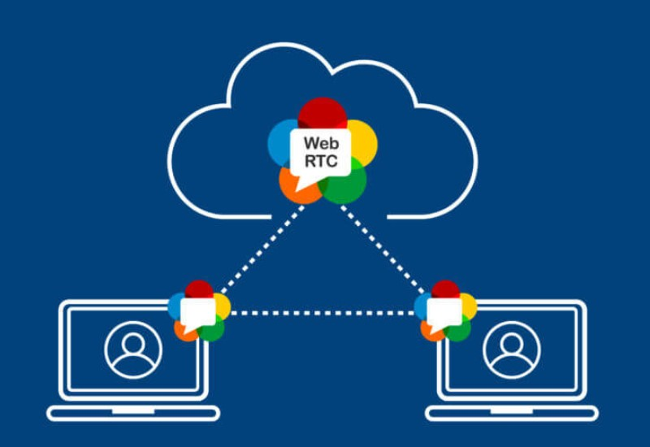
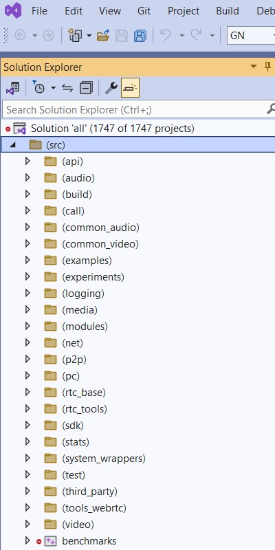
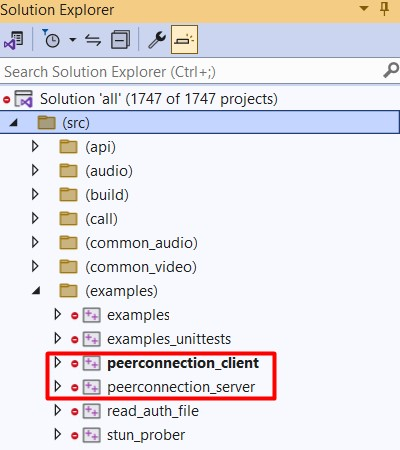
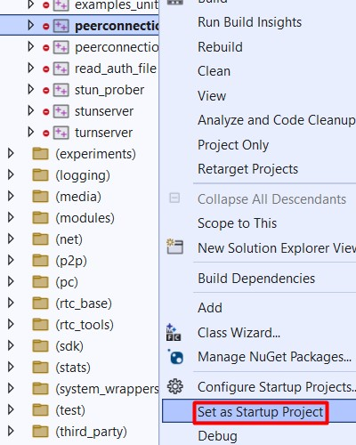
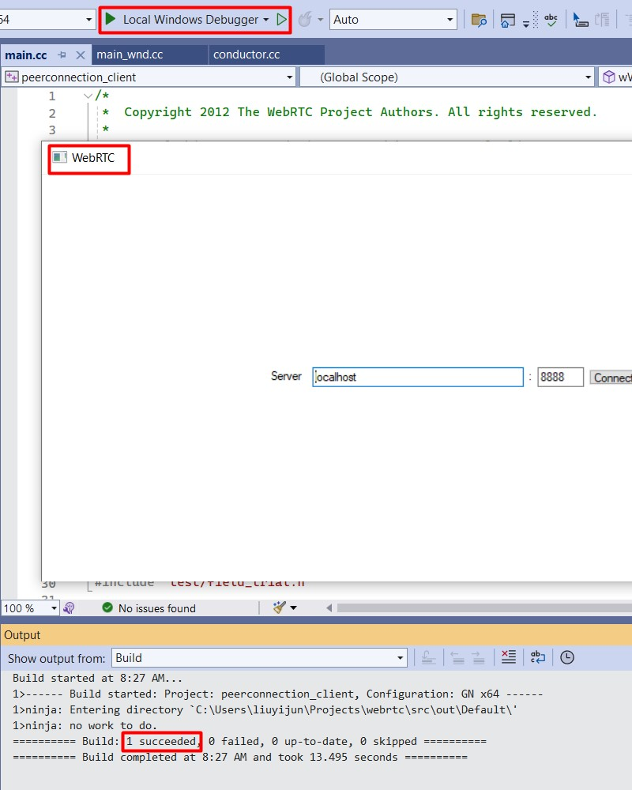

# WebRTC #

**WebRTC (Web Real-Time Communication)** is a free and open-source project written in C++, providing applications with **real-time communication (RTC)** via **application programming interfaces (APIs)**. 



It supports video, voice, and generic data to be sent between peers, allowing developers to build powerful voice- and video-communication solutions. The technology is available on all modern browsers as well as on native clients for all major platforms. 

## Build WebRTC in Windows ##

1. Install **WinSDK** (check "Debugging Tools For Windows): https://developer.microsoft.com/en-us/windows/downloads/windows-sdk/

2. Install **MS Visual Studio 2022** (In Desktop development with C++, check "Win10 SDK 10.0.20348", "MFC" and "ATL"): https://visualstudio.microsoft.com/downloads/

3. Install **depot_tools**: https://storage.googleapis.com/chrome-infra/depot_tools.zip

4. Add depot_tools folder to Environment Variables (system variables) Path

5. In cmd, run "```gclient```" to install required tools (like git, python)

6. Add some additional settings in cmd:
    ```
    set vs2022_install=C:\Program Files\Microsoft Visual Studio\2022\Community
    set GYP_GENERATORS=msvs-ninja,ninja
    set WINDOWSSDKDIR=C:\Program Files (x86)\Windows Kits\10
    set DEPOT_TOOLS_WIN_TOOLCHAIN=0
    ```

7. Configure Git
    ```
    git config --global user.name "My Name"
    git config --global user.email "my-name@domain"
    git config --global core.autocrlf false
    git config --global core.filemode false
    git config --global branch.autosetuprebase always
    ```

8. Download source code to specific directory:
    ```
    mkdir webrtc
    cd webrtc
    fetch --nohooks webrtc
    (if interrupted) gclient sync
    ```
9. Compile project
    ```
    cd src
    gn gen --ide=vs2022 out/Default
    ninja -C out/Default
    ```
10. Open with VS2022

    

## Get start on the first sample - peerconnection

1. Find the target sample

    

2. Set it as "Startup Project"

    

3. Run it and confirm no error raised

    