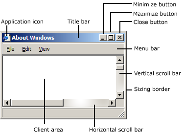
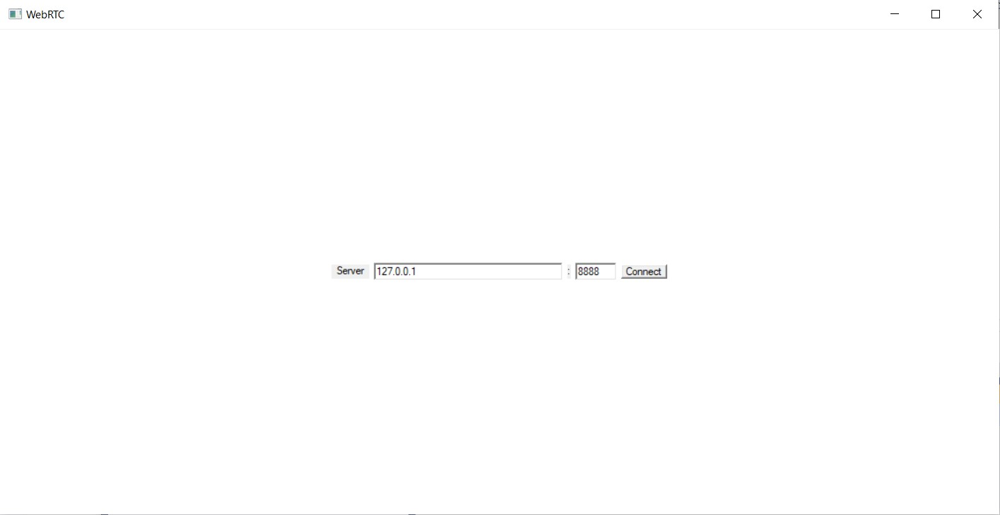
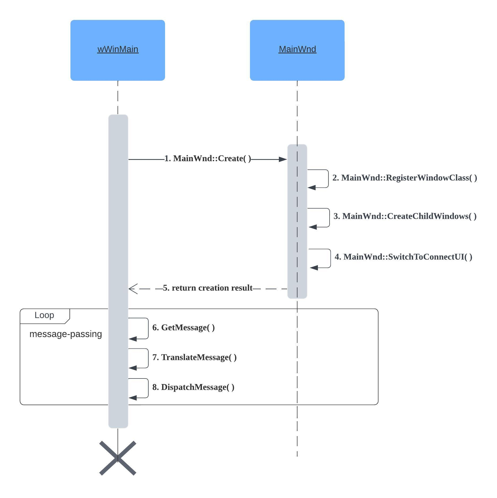

# Create UI in Windows Application #

## Desktop Window ##

The **desktop window** is a system-defined window that paints the background of the screen and serves as the base for all windows displayed by all applications.

The desktop window uses a bitmap to paint the background of the screen. The pattern created by the bitmap is called the **desktop wallpaper**.

## Application Windows ##
Every graphical Windows-based application creates at least one window, called the **main window**, that serves as the primary interface between the user and the application. Most applications also create other windows, either directly or indirectly, to perform tasks related to the main window. Each window plays a part in displaying output and receiving input from the user.



### Client Area ###

The **client area** is the part of a window where the application displays output, such as text or graphics.

### Nonclient Area ###

The title bar, menu bar, window menu, minimize and maximize buttons, sizing border, and scroll bars are referred to collectively as the window's nonclient area. The system manages most aspects of the nonclient area; the application manages the appearance and behavior of its client area.

## Controls ##

A control is a window that an application uses to obtain a specific piece of information from the user. Controls are always used in conjunction with another window - typically, a dialog box, which is a window that contains one or more controls.

List some controls used in our program:

### Static ###

A static control provides the user with informational text and graphics that typically require no response.

```c++
HWND wnd = CreateWindowExW(
	0, 								    // extended window style 							
	L"Static",						    // window class name
	L"",							    // window name
	WS_CHILD | ES_CENTER | ES_READONLY,	// window style
	...);
```
- `WS_CHILD` - the windows is a child window.
- `ES_CENTER` - centers text.

> https://learn.microsoft.com/en-us/windows/win32/controls/static-controls

### Edit ###

An edit control is a rectangular control window typically used in a dialog box to permit the user to enter and edit text by typing on the keyboard.

```c++
HWND wnd = CreateWindowExW(
	WS_EX_CLIENTEDGE,
    L"Edit",
    L"",
    WS_CHILD | ES_LEFT | ES_NOHIDESEL | WS_TABSTOP,
	...);
```
- `WS_EX_CLIENTEDGE` - the window has a boarder with a sunken edge.
- `ES_LEFT` - aligns text with the left margin.
- `ES_NOHIDESEL` - negates the default behavior .
- `WS_TABSTOP` - the window is a control that can receive the keyboard focus when the user presses the TAB key.

> https://learn.microsoft.com/en-us/windows/win32/controls/edit-controls

### Button ###

A button is a control the user can click to provide input to an application.

```c++
HWND wnd = CreateWindowExW(
	0,
    L"Button",
    L"",
    WS_CHILD | BS_CENTER | WS_TABSTOP,
	...);
```
- `BS_CENTER` - centers text horizontally in the button rectangle.

> https://learn.microsoft.com/en-us/windows/win32/controls/buttons

### Listbox ###

A list box is a control window that contains a simple list of items from which the user can choose.

```c++
HWND wnd = CreateWindowExW(
	WS_EX_CLIENTEDGE,
    L"ListBox",
    L"",
    WS_CHILD | LBS_HASSTRINGS | LBS_NOTIFY,
	...);
```
- `LBS_HASSTRINGS` - specifies that a list box contains items consisting of strings.
- `LBS_NOTIFY` - causes the list box to send a notification code to the parent window whenever the user clicks a list box item.

> https://learn.microsoft.com/en-us/windows/win32/controls/list-boxes


## "peerconnection client" UI Design ##




### Sequence diagram ###


