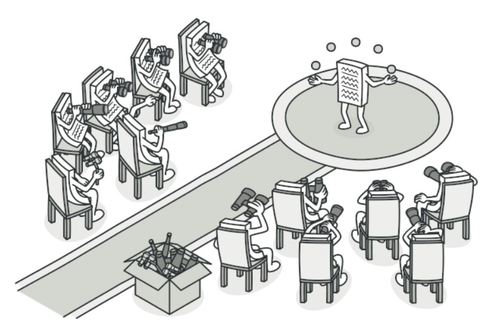
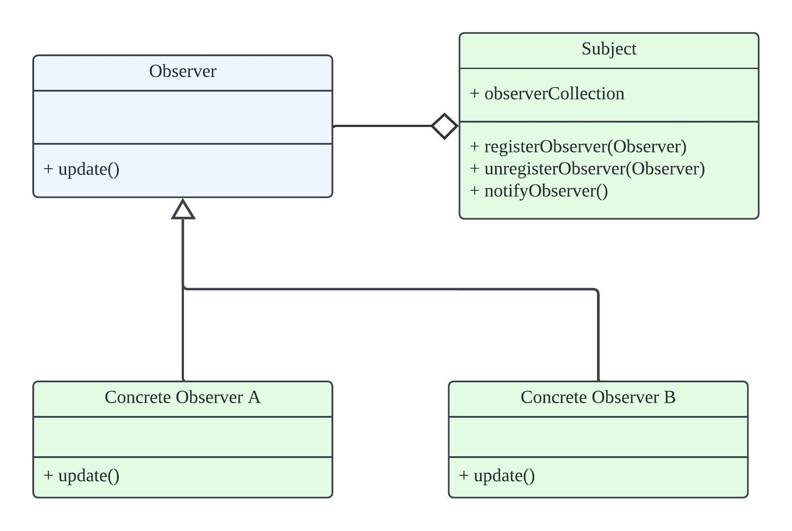

# Observer Pattern #

The **observer pattern** is a software design pattern in which an object, named the **subject**, maintains a list of its dependents, called **observers**, and notifies them automatically of any state changes, usually by calling one of their methods.



## Key Components ##

To use observer pattern, we should implement 3 core components: **Subject**, **Observer** and **Concrete Observer**, see class diagram as below:



To be observed, **Subject** should provide a abstract class **Observer**. Anyone (**Concrete Observer A** or **Concrete Observer B**) implemented (inherited) **Observer** can observe **Subject**.

## Observer Pattern used in peerconnection client ##

There are 3 main components in peerconnection client:
+ MainWnd
+ PeerConnectionClient
+ Conductor

`MainWnd` is a subject

```c++
class MainWndCallback {
 public:
  virtual void StartLogin(const std::string& server, int port) = 0;
  virtual void DisconnectFromServer() = 0;
  virtual void ConnectToPeer(int peer_id) = 0;
  virtual void DisconnectFromCurrentPeer() = 0;
  virtual void UIThreadCallback(int msg_id, void* data) = 0;
  virtual void Close() = 0;

 protected:
  virtual ~MainWndCallback() {}
};

class MainWnd {
 public:
  virtual void RegisterObserver(MainWndCallback* callback);

 private:
  MainWndCallback* callback_;
}

```

`PeerConnectionClient` is a subject

```c++
struct PeerConnectionClientObserver {
  virtual void OnSignedIn() = 0;  // Called when we're logged on.
  virtual void OnDisconnected() = 0;
  virtual void OnPeerConnected(int id, const std::string& name) = 0;
  virtual void OnPeerDisconnected(int peer_id) = 0;
  virtual void OnMessageFromPeer(int peer_id, const std::string& message) = 0;
  virtual void OnMessageSent(int err) = 0;
  virtual void OnServerConnectionFailure() = 0;

 protected:
  virtual ~PeerConnectionClientObserver() {}
};

class PeerConnectionClient : public sigslot::has_slots<> {
 public:
  void RegisterObserver(PeerConnectionClientObserver* callback);

 protected:
  PeerConnectionClientObserver* callback_;
}

```

`Conductor` is a observer which can observe 4 subjects. (other 2 subjects comes from webrtc library)

```c++
class Conductor : public webrtc::PeerConnectionObserver,
                  public webrtc::CreateSessionDescriptionObserver,
                  public PeerConnectionClientObserver,
                  public MainWndCallback {

}
```

### Workflow ###

1\. `Conductor` adds itself to subjects in conductor function.

```c++
Conductor::Conductor(PeerConnectionClient* client, MainWindow* main_wnd)
    : peer_id_(-1), loopback_(false), client_(client), main_wnd_(main_wnd) {
  client_->RegisterObserver(this);
  main_wnd->RegisterObserver(this);
}
```
2\. When Button Click event comes, `MainWnd` notified the observer `Conductor`, then `Conductor` tells `PeerConnectionClient` to perform specific actions.

```c++
void MainWnd::OnDefaultAction() {
  callback_->StartLogin(server, port);
}

void Conductor::StartLogin(const std::string& server, int port) {
  client_->Connect(server, port, GetPeerName());
}

```

3\. If `PeerConnectionClient` found input is incorrect, it will notify observer `Conductor`, then `Conductor` tell `MainWnd` to perform specific actions.

```c++

void PeerConnectionClient::Connect(const std::string& server,
                                   int port,
                                   const std::string& client_name) {
  callback_->OnServerConnectionFailure();
}

void Conductor::OnServerConnectionFailure() {
  main_wnd_->MessageBox("Error", ("Failed to connect to " + server_).c_str(),
                        true);
}

```

## sigslot ##

**sigslot** is a C++ library which can be considered a form of the Observer pattern, and widely used in WebRTC project. It provides a flexible and loosely coupled way to establish communication between objects.

There are 2 components in sigslot:

1. **signal** (subject): used to connect functions provided by slots. They emit signals to invoke the bound functions.
2. **slot** (observer): need to inherit from `sigslot::has_slots<>`. They provide functions that can be connected to signals, enabling them to respond to signal emissions.

An example:

```c++
#include <sigslot/sigslot.h>

// define a slot
class Receiver : public sigslot::has_slots<> {
public:
    void onSignalReceived() {
        std::cout << "Signal received!" << std::endl;
    }
};

// define a signal owner
class Emitter {
public:
    sigslot::signal<> signalEmitted;
};

int main() {
    Emitter emitter;
    Receiver receiver;

    // bind signal and slot
    emitter.signalEmitted.connect(&receiver, &Receiver::onSignalReceived);

    // emit signal
    emitter.signalEmitted();

    return 0;
}
```

In peerconnection client, `PeerConnectionClient` defined as a slot.

```c++
#include "rtc_base/third_party/sigslot/sigslot.h"
class PeerConnectionClient : public sigslot::has_slots<> {...}
```