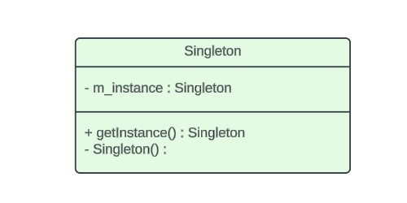
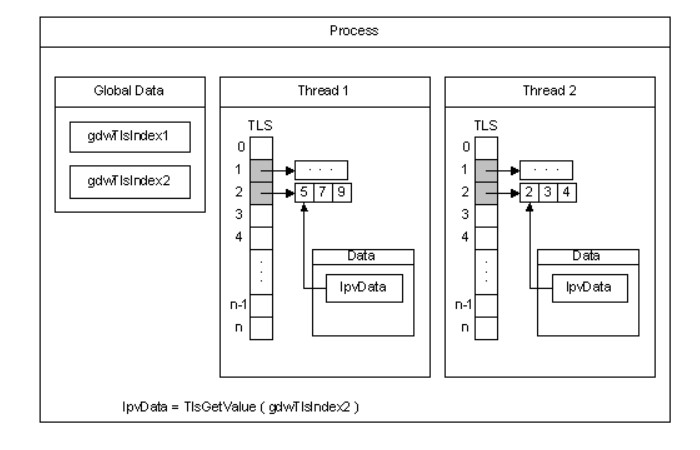
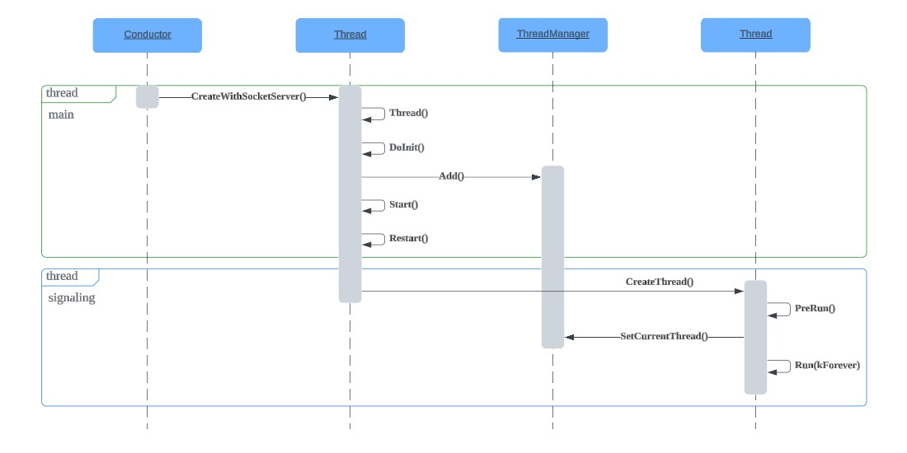

# Singleton Pattern #

The Singleton is one of the simplest design patterns. It ensures a class only has one instance, and provides a global point of access to it.

There are two common approaches to implement the Singleton pattern:
+ **Eager initialization**: involves creating the Singleton instance at the time of class loading.
+ **Lazy initialization**: defers the creation of Singleton instance until it is actually needed. This approach is particularly useful when the Singleton object is resource-intensive.



## Considerations for multi-thread ##

```c++
// not safe in multi-thread
Singleton* Singleton::getInstance(){
    if (m_instance == nullptr){
        m_instance = new Singleton();
    }
    return m_instance;
}

// safe in multi-thread, but overspend
Singleton* Singleton::getInstance(){
    Lock lock;
    if (m_instance == nullptr){
        m_instance = new Singleton();
    }
    return m_instance;
}

// double-check locking, not safe as reorder
Singleton* Singleton::getInstance(){
    if (m_instance == nullptr){
        Lock lock;
        if (m_instance == nullptr){
            m_instance = new Singleton();
        }
    }
    return m_instance;
}

/* 
 * reorder issue
 *
 * assembling "m_instance = new Singleton();"
 *
 * expected:
 *  CALL malloc
 *  CALL Singleton_constructor
 *  MOV [m_instance], EAX

 * sometimes:
 *  CALL malloc
 *  MOV [m_instance], EAX
 *  CALL Singleton_constructor
 */

// safe version since C++ 11
std::atomic<Singleton*> Singleton::m_instance;
std::mutex Singleton::m_mutex;

Singleton* Singleton::getInstance(){
    Singleton* tmp = m_instance.load(std::memory_order_relaxed);
    std::atomic_thread_fence(std::memory_order_acquire)；
    if (tmp == nullptr){
        std::lock_guard<std::mutex> lock(m_mutex);
        tmp = m_instance.load(std::memory_order_relaxed);
        if (tmp == nullptr){
            tmp = new Singleton();
            std::atomic_thread_fence(std::memory_order_release)；
            m_instance.store(tmp, std::memory_order_relaxed);
        }
    }
    return tmp;
}
```

## Singleton in ```rtc::ThreadManager``` ##

```c++
// rtc_base/thread.h
class RTC_EXPORT ThreadManager {
public:
    static ThreadManager* Instance();

private:
    ThreadManager();
    ~ThreadManager();

    ThreadManager(const ThreadManager&) = delete;
    ThreadManager& operator=(const ThreadManager&) = delete;
}

// rtc_base/thread.c
ThreadManager* ThreadManager::Instance() {
  static ThreadManager* const thread_manager = new ThreadManager();
  return thread_manager;
}
```


# Thread Local Storage (TLS) #

All threads of a process share its virtual address space. The local variables of a function are unique to each thread that runs the function. However, the static and global variables are shared by all threads in the process. 

With **thread local storage (TLS)**, you can provide unique data for each thread that the process can access using a global index.



| Windows | Linux | Description |
|----------|----------|----------|
| TlsAlloc | pthread_key_create | create index |
| TlsGetValue | pthread_getspecific | get value  |
| TlsSetValue | pthread_setspecific | set value |
| TlsFree | pthread_key_delete | delete index |

```c++
// rtc_base/thread.h 

// create the TLS key in main thread
ThreadManager::ThreadManager() : key_(TlsAlloc()) {}

// set value with key
void ThreadManager::SetCurrentThreadInternal(Thread* thread) {
  TlsSetValue(key_, thread);
}

// get value with key
Thread* ThreadManager::CurrentThread() {
  return static_cast<Thread*>(TlsGetValue(key_));
}

```

# Example: create signaling thread #

```c++

// examples/peerconnection/client/conductor.cc

Conductor::InitializePeerConnection{
	  if (!signaling_thread_.get()) {
    signaling_thread_ = rtc::Thread::CreateWithSocketServer();
    signaling_thread_->Start();
  }
}
```



What's inside ```Thread::Run()```:

```c++
while (true){
	void* (*task)() = Get();
	Dispatch(task);
}

Dispatch(void* (*task)()){
	task();
}
```